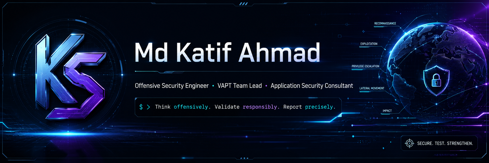
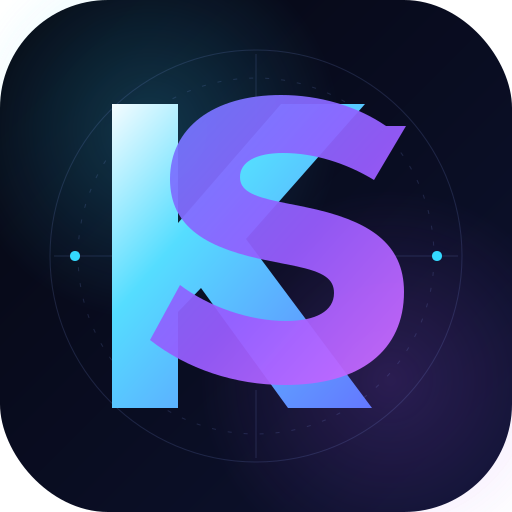
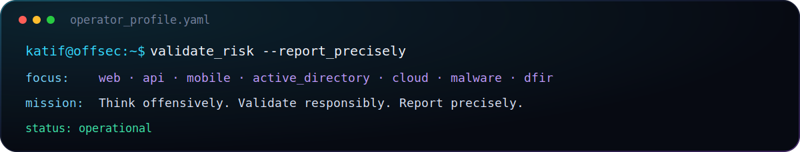

<p align="center">
  
</p>

<p align="center">
  <a href="https://git.io/typing-svg">
    
  </a>
</p>

<p align="center">
  <a href="https://katifsec.vercel.app">
    
  </a>
  <a href="https://www.linkedin.com/in/md-katif-ahmad-574193265/">
    
  </a>
  <a href="https://github.com/katifsec">
    
  </a>
  <a href="https://medium.com/@katifsec">
    
  </a>
</p>

<p align="center">
  
</p>

## `> OPERATOR_PROFILE`

<table>
<tr>
<td width="22%" align="center" valign="middle">



</td>
<td width="78%" valign="top">

```yaml
identity:
  name: "Md Katif Ahmad"
  handle: "katifsec"
  role: "Offensive Security Engineer / VAPT Team Lead"
  education: "BCA — Cloud & Security"

operating_domains:
  - Web & API Penetration Testing
  - Android Application Security
  - Active Directory & Internal Security
  - Malware Analysis & Reverse Engineering
  - Digital Forensics & Incident Response
  - Cloud, Container & CI/CD Security
  - VAPT Reporting & Technical Review

mission: "Identify weaknesses, validate risk, and deliver actionable remediation."
```

</td>
</tr>
</table>

<p align="center">
  
</p>

I work across **offensive security, application security, vulnerability assessment, penetration testing, technical validation, and professional security reporting**.

As a **Cybersecurity Consultant and VAPT Team Lead**, I support assessment planning, testing coordination, finding validation, maker-checker review, evidence quality, remediation guidance, retesting, and client-ready delivery.

---

## `> CURRENT_OPERATIONS`

```diff
+ Building PTdoc into an advanced VAPT reporting workspace
+ Advancing Web, API, Android, and AI-system security testing
+ Improving source-code review and secure-code analysis
+ Expanding Active Directory and internal-network tradecraft
+ Practising malware analysis, reverse engineering, and memory forensics
+ Developing practical offensive-security tools and automation
```

---

## `> OFFENSIVE_CAPABILITIES`

<table>
<tr>
<td width="50%" valign="top">

### `01 // APPLICATION SECURITY`

- Web application penetration testing
- API security assessment
- Android application security
- Authentication and session testing
- Authorization and IDOR testing
- Business-logic vulnerability analysis
- Source-code review
- SAST and DAST validation
- AI application security testing

</td>
<td width="50%" valign="top">

### `02 // INFRASTRUCTURE & AD`

- Network infrastructure testing
- Active Directory security assessment
- Linux and Windows privilege escalation
- Internal network reconnaissance
- Cloud security assessment
- Container and Docker security
- CI/CD pipeline security
- Attack-path analysis
- Red-team methodology

</td>
</tr>

<tr>
<td valign="top">

### `03 // MALWARE & DFIR`

- Static and behavioural malware analysis
- Binary triage
- Reverse engineering
- Memory forensics
- Windows artefact analysis
- YARA rule development
- Indicator extraction
- Incident investigation support

</td>
<td valign="top">

### `04 // REPORTING & LEADERSHIP`

- VAPT report development
- Executive-summary preparation
- CVSS and risk validation
- Maker-checker review workflow
- Evidence and PoC quality review
- Remediation guidance
- Retesting and closure validation
- Junior tester mentoring
- Assessment SOP development

</td>
</tr>
</table>

---

## `> SECURITY_ARSENAL`

### Offensive Security

<p>
  
  
  
  
  
  
  
  
</p>

### Mobile, Malware & DFIR

<p>
  
  
  
  
  
  
  
</p>

### Engineering & Platforms

<p>
  
  
  
  
  
  
  
</p>

---

## `> FLAGSHIP_BUILD`

### PTdoc — VAPT Report Workspace

> A professional VAPT report-generation and assessment-management platform designed for penetration testers, reviewers, team leads, and security consulting teams.

```text
PTdoc
├── Structured vulnerability findings
├── Evidence and PoC management
├── Executive-summary generation
├── Maker-checker review workflow
├── Retesting and closure lifecycle
├── Client-ready report export
├── Assessment and project tracking
└── Context-aware local AI assistance through Ollama
```

**Focus:** security reporting quality, assessment consistency, reviewer workflows, and professional client delivery.

---

## `> SECURITY_TOOLING_PROJECTS`

<table>
<tr>
<td width="33%" valign="top">

### Statix

**Static Binary Analysis**

- MD5 and SHA-256 extraction
- ASCII and UTF-16 strings
- Entropy analysis
- Suspicious imports
- Registry indicators
- Optional Radare2 extraction

</td>
<td width="33%" valign="top">

### MOF

**Meta of File**

- Metadata extraction
- Hash generation
- Hidden-content detection
- Embedded-data discovery
- Image and video inspection
- Document and archive analysis

</td>
<td width="33%" valign="top">

### TPS

**Turbo Port Scanner**

- Fast port enumeration
- Service identification
- Internal assessment support
- Lightweight Python execution
- Rapid attack-surface discovery

</td>
</tr>
</table>

---

## `> FIELD_SIGNALS`

- Reported **30+ valid security vulnerabilities** across authorised assessments, bug-bounty programs, and open-source projects.
- Ranked among the **Top 100 participants** in the 2024 Great AppSec Hackathon.
- Built custom tools for malware triage, forensic analysis, network reconnaissance, and VAPT reporting.
- Gained hands-on experience across web exploitation, API security, privilege escalation, reverse engineering, malware analysis, and digital forensics.
- Mentored junior testers in finding validation, PoC preparation, business-logic testing, and professional report writing.

---

## `> CERTIFICATIONS`

<p align="center">
  
  
  
  
</p>

---

## `> FRAMEWORKS`

```text
OWASP Top 10            OWASP API Security Top 10
OWASP MASVS / MSTG      MITRE ATT&CK
NIST CSF                ISO/IEC 27001
CVSS                    CWE
PTES                    Risk-Based Vulnerability Management
```

---

## `> GITHUB_INTELLIGENCE`

<p align="center">
  
  
</p>

<p align="center">
  
</p>

<p align="center">
  
</p>

---

## `> RESPONSIBLE_DISCLOSURE`

I perform security testing only against systems I own, authorised lab environments, explicitly permitted client scopes, and approved vulnerability-disclosure programs.

My objective is to identify weaknesses responsibly, communicate risk accurately, and help organisations strengthen their security posture.

---

## `> ESTABLISH_CONNECTION`

<p align="center">
  <a href="https://katifsec.vercel.app">
    
  </a>
  <a href="https://www.linkedin.com/in/md-katif-ahmad-574193265/">
    
  </a>
  <a href="mailto:mdkatif78590@gmail.com">
    
  </a>
</p>

<p align="center">
  
</p>

<p align="center">
  <code>Think offensively. Validate responsibly. Report precisely.</code>
</p>
